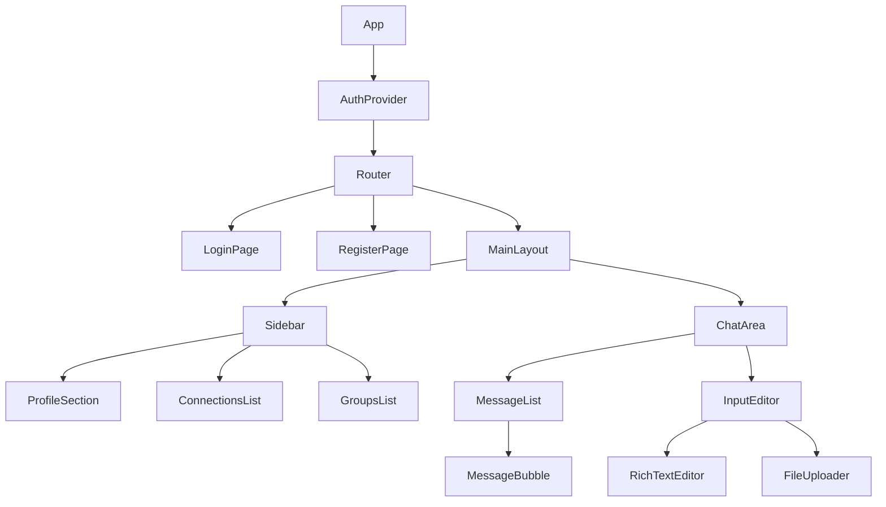

# Nexus Hub Chat App

## Table of Contents
- [Nexus Hub Chat App](#nexus-hub-chat-app)
  - [Table of Contents](#table-of-contents)
  - [Project Overview](#project-overview)
  - [Time Allocation](#time-allocation)
      - [Key Observations and Challenges:](#key-observations-and-challenges)
  - [Challenges and Solutions](#challenges-and-solutions)
  - [Architecture Flexibility](#architecture-flexibility)
    - [Project Structure](#project-structure)
  - [Key Components and Features (Project Architecture)](#key-components-and-features-project-architecture)
  - [Setup and Installation](#setup-and-installation)
  - [Running the Project](#running-the-project)
  - [Technology Stack](#technology-stack)
  - [Code Quality and Development Tools](#code-quality-and-development-tools)
  - [Security (Row Level Security) - Supabase](#security-row-level-security---supabase)
  - [Development Workflow and Deployment](#development-workflow-and-deployment)
    - [GitFlow Workflow](#gitflow-workflow)
    - [Feature Development Process](#feature-development-process)
    - [Deployment on Vercel](#deployment-on-vercel)
  - [Future Work and Planned Features](#future-work-and-planned-features)

## Project Overview
A chat application built with React and Supabase, featuring rich text editing, and robust state management.


## Time Allocation

This project was completed within a compressed timeframe of approximately 28 total hours, amidst significant work overload and other commitments. The intensity of the development process and the need to quickly adapt to new technologies characterized this project. Here's a breakdown of how time was allocated:

1. Initial Setup and Tool Configuration: 25% (~ 7 hours)
   - Project structure setup
   - Installation and configuration of development tools
   - Environment setup (ESLint, Prettier, TypeScript, etc.)
   - Initial Supabase project creation and configuration

2. Supabase Investigation and Backend Development: 25% (~ 7 hours)
   - Deep dive into Supabase capabilities and limitations
   - API design and implementation using Supabase
   - Database schema design and setup
   - Authentication implementation

3. Frontend Development: 18% (~ 5 hours)
   - UI implementation with React and Tailwind CSS
   - Component development
   - State management setup (Redux, React Query)

4. Rich Text Editor Integration: 14% (~ 4 hours)
   - Initial attempt with Lexical
   - Transition to and implementation of TipTap
   - Custom extensions for tables and images

5. Image Handling and File Attachments: 11% (~ 3 hours)
   - Implementation of image upload to Supabase Storage
   - Image resizing and manipulation in the editor
   - Integration with message sending process

6. Documentation and Code Organization: 4% (~ 1.25 hours)
   - README creation and updates
   - Code commenting and organization
   - Quick documentation of key decisions and challenges

7. Real-time Feature Investigation: 2% (~ 0.5 hours)
   - Preliminary research on Supabase real-time capabilities
   - Initial implementation attempts

8. Testing and Refinement: 1% (~ 0.25 hours)
   - Basic manual testing of core features
   - Critical bug fixes

Total Time: ~28 hours

#### Key Observations and Challenges:
- The project was completed under significant time pressure and work overload, necessitating rapid decision-making and efficient use of available time.
- Backend development with Supabase required significant investment, balancing the need to understand the platform deeply with the pressure to produce a functional prototype quickly.
- Image handling and rich text editor integration were prioritized as core features, essential for the chat application's functionality.
- Documentation, while limited by time constraints, was given attention to ensure key decisions and challenges were recorded for future reference.
- The compressed timeframe necessitated a focus on core features, with limited time for extensive testing and real-time feature development.
- Balancing the need for a functional prototype with the desire for code quality and comprehensive documentation was an ongoing challenge.


## Challenges and Solutions

During the development process, I encountered and addressed several significant challenges:
1. Custom Backend Development
   - **Challenge**: The project required a custom backend solution, necessitating building from scratch.
   - **Solution**: Leveraged **Supabase** as the backend, providing a flexible foundation for the project's needs. This involved:
     - Iterative development cycles
     - Extensive manual testing to ensure proper implementation of all required functionalities

2. Rich Text Editor Integration
   - **Challenge**: Initially attempted to use **Lexical** (Facebook's rich text editor), which proved difficult to extend for specific project needs.
   - **Solution**: Transitioned to **TipTap**, offering greater flexibility and customization options. This change enabled more efficient implementation of required rich text features.

3. Complex Element Rendering in Editor
   - **Challenge**: Displaying and resizing complex elements (tables and images) within the rich text editor while maintaining editability and proper rendering.
   - **Solution**: Developed custom TipTap extensions for table and image handling. Conducted thorough manual testing to ensure correct display in both creation and viewing modes.

4. File (Image) Attachment Handling
   - **Challenge**: Implementing a more complex workflow for file attachments compared to simple text messages.
   - **Solution**: Developed a two-step process:
     1. Pre-upload files to **Supabase Storage**.
     2. Attach the resulting URL to the message content JSON.
   This approach improved message sending efficiency and reduced main database load.

5. Real-time Data Synchronization (Ongoing)
   - **Challenge**: Ensuring consistent data across multiple clients in real-time, particularly for active chat sessions.
   - **Current Approach**: 
     - Investigating Supabase's real-time capabilities
     - Utilizing `react-query` for refetching when in chat view and at set intervals
   - **Status**: Ongoing development and optimization, including:
     - Experimentation with supabase channels configurations
     - Exploration of optimistic updates and conflict resolution strategies
   - **Next Steps**:
     - Conduct thorough multi-user testing to identify synchronization issues
     - Implement robust error handling and recovery for connection interruptions
     - Consider fallback polling mechanism for scenarios where real-time updates fail

These challenges necessitated extensive research and adaptive approaches throughout the development process. The iterative nature of the project highlighted the importance of reaching implementation milestones to fully understand and address limitations.

## Architecture Flexibility

Application architecture is designed with modularity and adaptability in mind:

1. **Backend Agnostic**: While currently using Supabase, the application's structure allows for easy integration with other backend solutions or a custom API.

2. **State Management**: The use of Redux Toolkit and React Query provides a clear separation between UI state and server state, making it easier to switch backend services without major refactoring.

3. **Component Structure**: UI components are built with reusability in mind, allowing for easy customization and extension.

4. **Feature Modules**: The application is organized into feature modules (e.g., auth, chat), making it straightforward to add, remove, or modify functionality.

This flexible architecture ensures that Nexus Hub can evolve and adapt to changing requirements and technologies over time.


### Project Structure
```
nexus-hub/
├── src/
│ ├── app/
│ │ ├── configs/
│ │ ├── constants/
│ │ ├── hooks/
│ │ ├── router/
│ │ ├── schemas/
│ │ ├── types/
│ │ └── utils/
│ ├── assets/
│ ├── components/
│ │ ├── input-editor/
│ │ └── ui/
│ ├── features/
│ │ ├── auth/
│ │ └── chat/
│ ├── layouts/
│ ├── lib/
│ ├── pages/
│ ├── store/
│ │ ├── actions/
│ │ ├── selectors/
│ │ └── slices/
│ └── stories/
```



## Key Components and Features (Project Architecture)


1. **App Configuration (`src/app/configs/`)**
   - Environment configuration
   - Supabase setup

2. **Router (`src/app/router/`)**
   - Authentication loader
   - Main routing setup

3. **Types and Schemas (`src/app/types/` and `src/app/schemas/`)**
   - TypeScript type definitions for API, auth, connections, and messages
   - **Yup** schemas for form validation

4. **UI Components (`src/components/ui/`)**
   - Shadcn components like Avatar, Button, Card, Dropdown Menu, etc.

5. **Input Editor (`src/components/input-editor/`)**
   - Custom input editor with extensions
   - Image insertion functionality
   - Table insertion dialog

6. **Authentication Feature (`src/features/auth/`)**
   - Login and Registration pages
   - Authentication services and hooks

7. **Chat Feature (`src/features/chat/`)**
   - Chat area component
   - Message bubble component
   - Hooks for listing messages, sending messages, and chat subscription

8. **State Management (`src/store/`)**
   - Redux setup with slices for auth and chat
   - Actions and selectors for state management

9. **Layouts (`src/layouts/`)**
   - Error boundary component
   - Root layout component

10. **Main Application Page (`src/pages/app.page.tsx`)**
    - Entry point for the application UI

## Setup and Installation
1. Clone the repository:
    ```bash
    git clone https://github.com/MohammadKhallaf/nexus-hub.git
    ```
2. Install dependencies:
    ```bash
    npm install -g pnpm
    ```
    ```bash
    pnpm install
    ```
3. Set up environment variables:
   - Create a `.env` file in the root directory
   - Add the following variables:
     ```
     VITE_SUPABASE_URL      = {{your_supabase_project_url}}
     VITE_SUPABASE_API_KEY  = {{your_supabase_anon_key}}
     VITE_STORAGE_BUCKET    = {{ supabase_bucket }}
     ```

4. Start the development server:
    ```bash
    pnpm dev
    ```
5. Open `http://localhost:4000` in your browser to view the application.


## Running the Project

- Development mode: `pnpm dev`
- Build for production: `pnpm run build`
- Preview production build: `pnpm run preview`


## Technology Stack

This project uses a modern, efficient technology stack:

- **React**: Frontend Framework
- **Supabase**: Backend as a service (Auth - Storage - Realtime)
- **TypeScript**: For improved code maintainability and quality
- **Tailwind CSS**: CSS framework for rapidly building custom user interfaces with high customization
- **Shadcn** : UI component library, built on top of Tailwind CSS
- **TipTap**: Rich Text Editor with extensions
- **Storybook**: UI docuemtation and visual testing
- **Yup** : For schema validation and formatting
- State Management **`redux-toolki`**: For authentication and other global state handling
- Data Fetching Management **`react-query`**: For network requests optimization and caching
- Package Manager **`pnpm`**:
  - Faster installation times "comparing to `npm`"
  - Disk space efficiency "comparing to `npm`"
- Build Tool **`Vite`**:
  - Instant server start
  - Hot Module Replacement (HMR)
  - Optimized builds with rollup

## Code Quality and Development Tools

This project employs a comprehensive set of tools to ensure code quality, consistency, and efficient development:

- **ESLint**: JavaScript and TypeScript linter
  - Identifies and reports on patterns in code
  - Enforces coding standards
  - Integrates with IDEs and CI/CD pipelines

- **Prettier**: Opinionated code formatter
  - Ensures consistent code style across the project
  - Supports multiple languages and file types
  - Integrates seamlessly with most editors and ESLint

- **SonarLint**: Code quality and security scanner
  - Detects bugs, vulnerabilities, and code smells
  - Provides real-time feedback in IDE
  - Follows industry-standard coding rules

- **Husky**: Git hooks made easy
  - Automates pre-commit and pre-push checks
  - Prevents bad commits from being pushed
  - Customizable for project-specific needs

- **lint-staged**: Optimized linting for staged files
  - Improves performance by only checking changed files
  - Works in tandem with Husky for pre-commit checks
  - Supports running multiple commands on staged files

- **TypeScript**: Typed superset of JavaScript
  - Provides static typing for improved code quality
  - Enhances developer productivity with better tooling support
  - Catches potential errors at compile-time

- **Vitest**: Vite-native unit testing framework
  - Offers fast, out-of-the-box TypeScript support
  - Compatible with Jest's API for easy migration
  - Integrates well with Vite for a seamless developer experience

These tools work together to:
- Maintain high code quality standards
- Ensure **consistency** across the codebase
- Catch potential issues early in the development process


## Security (Row Level Security) - Supabase
- connections table:
  - Users can insert own connections
  - Users can update own connections
  - Users can view own connections
- group_members table:
  - Users can join groups
  - Users can leave group
  - Users can view members of groups they're in
- group_messages table:
  - Users can send messages to groups they're a member of
  - Users can view messages in groups they're a member of
- groups table:
  - User can create group
  - User who created the group can update info
  - Users can view groups they're member of
- messages table:
  - Enable insert for users based on user_id
  - Users can read messages if they are the sender or the receiver
  - Users can view messages in groups they are member of
- profiles table:
  - Enable insert for authenticated users only
  - Everyone can view public profiles
  - Users can update own profile
  - Users can view discoverable profiles
  - Users can view own profile


## Development Workflow and Deployment

This project follows the GitFlow workflow and is deployed on Vercel, optimizing the CI/CD usage for deployment.

### GitFlow Workflow

Use a modified GitFlow workflow to manage the development process:

1. **Main Branch**: `main`
   - Represents the latest production-ready state
   - Directly deployed to production

2. **Feature Branches**: `feat/*`
   - Created from `main`
   - Used for new features
   - Merged back into `main` via [Pull Requests](https://github.com/MohammadKhallaf/nexus-hub/pulls/)

3. **Release Branches**: `release/*`
   - Created from `main` when it's ready for a release
   - Only bug fixes, documentation, and release-oriented tasks go here
   - Merged to `main` when ready

4. **Fix Branches**: `fix/*`
   - Created from `main` for critical bugs in production
   - Merged to `main` 

### Feature Development Process

1. Create a new feature branch from `main`:
    ```bash
    git switch main
    git pull
    git switch -c feat/new-feature-name
    ```
2. Develop the feature, committing changes regularly.
3. Push the feature branch to the remote repository:
    ```bash
    git push -u origin feat/new-feature-name 
    ```
4. Open a Pull Request to merge the feature into `main`.
5. Accept the Pull Request and merge the feature branch.


### Deployment on Vercel

**Production Environment**:
- Connected to the `main` branch
- Deploys automatically when changes are merged to `main`
- Production: https://nexushub.vercel.app


## Future Work and Planned Features

While the current version of Nexus Hub provides a solid foundation for a chat application, there are several areas for future improvement and expansion:


1. **Enhanced Responsive Design**
   - Implement a fully responsive layout for all screen sizes
   - Optimize UI components for mobile and tablet devices
  
2. **Completed Real-time Functionality** (using supabase channels)
   - Enhance real-time message synchronization
   - Implement real-time user presence indicators
   - Add real-time notifications for new messages and events

3. **Backend Layer Customization**
   - Implement a custom API solution as an alternative to Supabase

4. **User Experience Improvements**
   - Customizable themes and layouts
   - Offline support and message queueing
   - Advanced search functionality for messages and users

5. **Performance Optimizations**
   - Implement virtualization for large chat histories
   - Optimize image and file loading
   - Improve real-time synchronization efficiency

